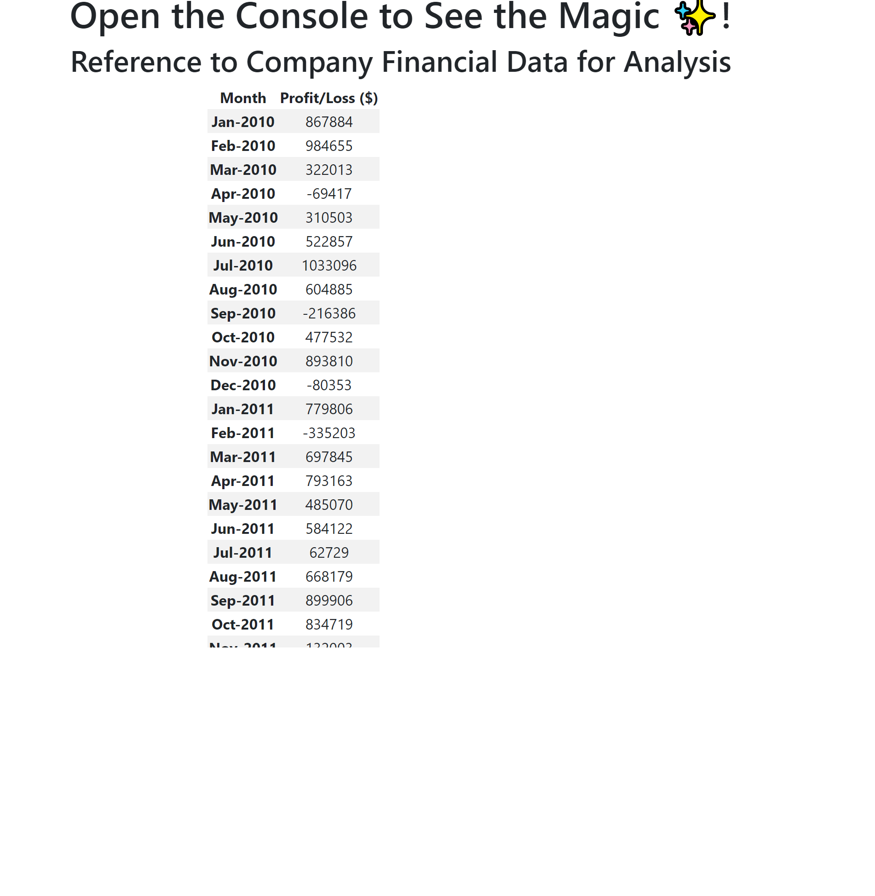
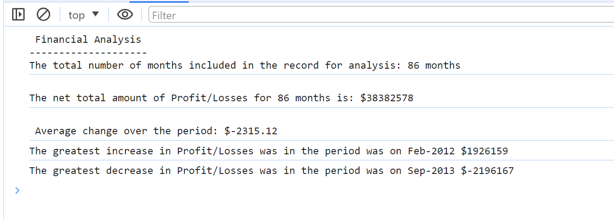

# Console-Finances

## Project Objective

To analyze the financial records of a company.

## Description

The purpose of this project was to to analyze the profit and loss data for a company and provide a comprehensive overview for the following:

- Determining the period with the highest profit and the greatest loss.
- Identifying the duration of this period.
- Net profit of the duration.
- Calculating the average difference in income over the entire period.

Learning:
- For each requirement, writing the pseudocode prior to coding was really helpful as it helped me think about what I needed to calculate, how to calculate and then write the code.

- There are so many functions avilable in javascript and there is so much to learn! Learning to being efficient with which method or function to use to execute the code was challenging but at the same time fulfilling! 

## Table of Contents 

- [Installation](#installation)
- [Features] (#Features)
- [Credits](#credits)
- [License](#license)

## Installation

Click this link to see the deployed link:
https://sumzulfikar.github.io/Console-Finances/ 

Right click and select Inspect. In the Developer mode select Console to see the results.

Console results:

## Features

In the console you will be able to see the following:
1. The total number of months included in the dataset.
2. The net total amount of Profit/Losses over the entire period.
3. The average of the changes in Profit/Losses over the entire period.
4. The greatest increase in profits (date and difference in the amounts) over the entire period.
5. The greatest decrease in losses (date and difference in the amounts) over the entire period.

## Credits

- Bootcamp Xpert and W3C was super helpful for this project.
- I am grateful for the help and support I received from from my TAs, and class mates.
- I googled various javascript youtube videos during this project which helped me think.

## License

MIT License

## Badges

## Tests

Acceptance Criteria met and comparing the expected results from starter Readme for the challenge.
